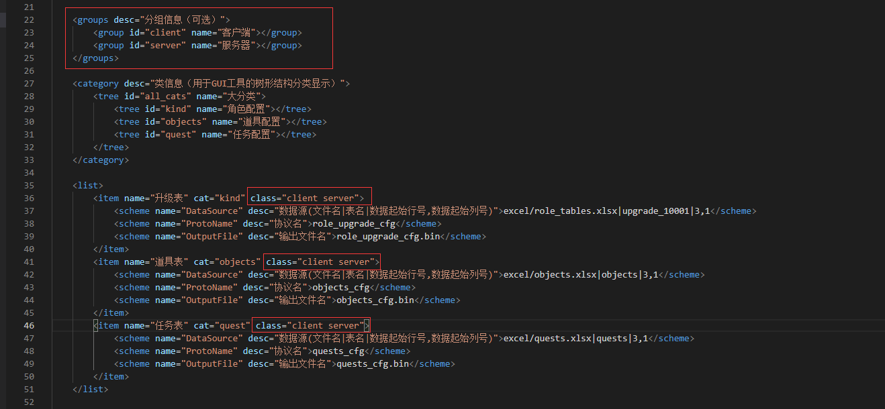
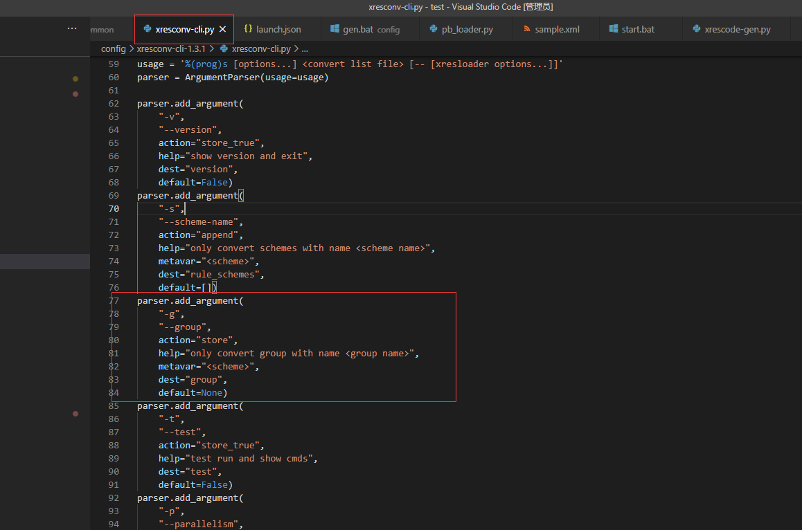
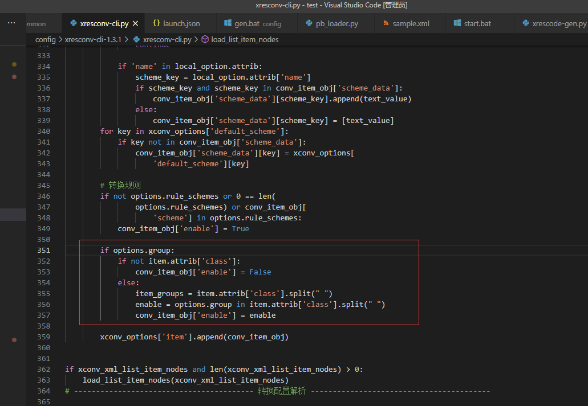
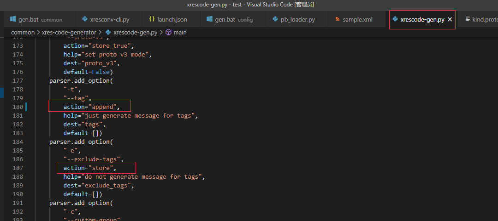

### 使用xresconv-cli批量转换配置

1. [下载地址](https://github.com/xresloader/xresconv-cli.git)

2. 使用
    ```bash
    py xresconv-cli-1.3.1/xresconv-cli.py sample.xml
    ```
    这里会将sample.xml中list里的所有item都转换一下，考虑到示例里也有groups以及item中的class，如图：
    
    猜测是区分server以及client双端转换配置用，但是xresconv-cli.py代码中又未支持这一块的配置，所以对代码作扩展支持
    
    

    ```bash
    # server端转换配置时就可以带上 -g server
    py xresconv-cli-1.3.1/xresconv-cli.py -g server sample.xml
    ```

### 使用xresconv-gui转换配置
1. [下载地址](https://github.com/xresloader/xresconv-gui.git)
    

### 使用 xres-code-generator 生成配置加载代码

1. [下载地址](https://github.com/xresloader/xres-code-generator.git)

2. 用一个Proto文件举例来说
    quest.proto
    ```proto
    syntax = "proto3";

    import "xresloader.proto";
    import "xrescode_extensions_v3.proto";
    // xresloader的发布页面 https://github.com/xresloader/xresloader/releases 下载 protocols.zip ，即可获取xresloader.proto


    message quests_cfg {
    option (xrescode.loader) = {
        file_path : "../config/sample-data/quests_cfg.bin"
        // file_list: "filelist.txt"
        indexes : {
            fields : "Id"
            index_type : EN_INDEX_KV 
        }
        indexes : {
            fields : "Type"
            index_type : EN_INDEX_IL
        }
        // 允许多个索引，索引命名是所有的 [fields 字段].join("_")，也可以通过name属性自定义
        tags : "client"
        tags : "server"
    };
    uint32 Id = 1;
    uint32 Type = 2;
    string Name = 3;
    string Desc = 4;
    }

    ```
    其中的tags用来标记需要在client端和server端都可以生成配置，当服务端生成时，带上参数 **-t "server"**，客户端生成时带上 **-t "client"**，这样同一份proto文件可以在两端使用了

    ```bash
    py ..\common\xres-code-generator\xrescode-gen.py -i ..\common\xres-code-generator\template -p ..\common\sample.pb -o ..\server\cfgsrc -g ..\common\xres-code-generator\template\config_manager.h.mako -g ..\common\xres-code-generator\template\config_manager.cpp.mako -g ..\common\xres-code-generator\template\config_easy_api.h.mako -g ..\common\xres-code-generator\template\config_easy_api.cpp.mako -l "H:..\common\xres-code-generator\template\config_set.h.mako" -l "S:..\common\xres-code-generator\template\config_set.cpp.mako" -t "server"
    ```

    > 这里不知是BUG，还是我用的不对，我改了代码才正常使用，理应都改成 **append**
    


- [x] 多配置表读取
- [x] 字符串解析
    - [x] 单格式
    - [x] 多种解析方式（one of）
- [ ] 配置版本    
- [ ] server client
    - xrescode-gen通过--tag参数可以指定需要生成的配置读取代码，配合proto文件中xrescode.loader.tags
    - 生成配置的二进制文件时，sample.xml中的group怎么使用